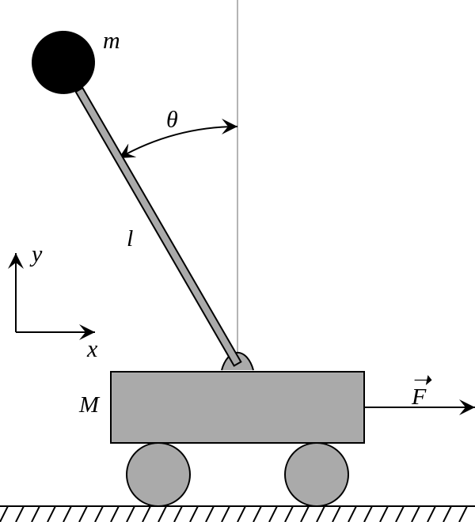
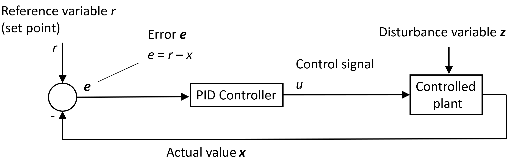

# Lab 1 -- Control of an Inverted Pendulum

**Embedded Systems Lab**

---

## Introduction

The inverted pendulum system is a classic example of a dynamic system that poses a real challenge in the field of control engineering due to its inherently unstable nature. This system consists of a pendulum that has its mass above its pivot point and is mounted on a moving cart. The primary goal in controlling an inverted pendulum is to apply forces to the cart in such a way that the pendulum remains upright and stable, despite disturbances or changes in motion. This system is inherently unstable. Small disturbances or deviations from the upright position will be amplified, causing the pendulum to fall quickly if uncorrected. Successful control of this system requires a feedback mechanism that reacts continuously to the pendulum’s state to maintain balance.

In this task, you will develop and implement control strategies to stabilize the inverted pendulum.

---

## Feedback Control and PID

Many software problems involve interaction with dynamic external processes. Feedback control is a powerful paradigm for managing those interactions. In feedback control, sensors measure the current state (e.g., position and angle of the pendulum), which is compared to the desired state. The difference (error) is fed into a controller, which calculates a corrective action to drive the system toward the desired state.

Many software problems involve interaction with dynamic external processes (e.g., network traffic). Feedback control is a powerful paradigm for managing those interactions. In feed- back control of dynamical systems, we use sensors to measure the current state of the system (such as the position and angle of the pendulum). This measurement is compared to the desired state (e.g., the pendulum balanced upright). The difference, known as the error, is fed into a controller. The controller calculates a corrective action designed to drive the system towards the desired state. The figure below shows a controller in a feedback loop.

A **PID (Proportional-Integral-Derivative) controller** is a widely used feedback control mechanism. It has three components, each targeting different aspects of the error signal:

- **Proportional (P):** Provides a corrective action proportional to the size of the current error.
$$
u_P(t) = K_p \cdot e(t)
$$
- **Integral (I):** Considers the accumulated error over time, helping to eliminate persistent offsets.
$$
u_I(t) = K_i \cdot \int e(t)
$$
- **Derivative (D):** Anticipates the rate of change of the error, improving the system’s responsiveness and damping oscillations.
$$
u_D(t) = K_d \cdot \frac{de(t)}{dt}
$$

The three components are combined to form the complete PID controller output:

$$
u(t) = K_p \cdot e(t) + K_i \cdot \int e(t) \, dt + K_d \cdot \frac{de(t)}{dt}
$$

where $u(t)$ is the PID controller output, $K_p$ is the Proportional gain, $K_i$ is the Integral gain, and $K_d$ is the Derivative gain. Think of the PID controller as an algorithm with the goal of minimizing error. Like many algorithms, its parameters ($K_p$, $K_i$, $K_d$) need careful tuning. The ideal controlled closed-loop response matches the reference input signal. Various common input signals are depicted in the figure below.

---

## Discrete-Time Implementation

Computers handle signals in discrete time steps, so a discrete-time version of the PID controller is needed:

$$
u(k) = \frac{b_0}{a_0} e(k) + \frac{b_1}{a_0} e(k-1) + \frac{b_2}{a_0} e(k-2) - \frac{a_1}{a_0} u(k-1) - \frac{a_2}{a_0} u(k-2)
$$

where the coefficients $a_0$, $a_1$, $a_2$, $b_0$, $b_1$, $b_2$ depend on the PID gains, sampling time $T_s$, and derivative filter coefficient $N$.

- **$N$:** Derivative filter coefficient (higher $N$ = more smoothing, less noise sensitivity)
- **$T_s$:** Sampling time (interval between measurements and control updates)

---

## Control Response

Control response refers to how a system reacts to input changes. It is crucial for designing and analyzing control systems. The response can be subdivided into:

- **Transient response:** Initial phase after a change in input. Key metrics:
    - *Rise time*: How quickly the system responds
    - *Settling time*: Time to stabilize within a tolerance band
    - *Overshoot*: How much the system exceeds its final value

- **Steady-state response:** Long-term behavior after settling. *Steady-state error* is the difference between desired and actual output.

PID parameters influence the response:
- Proportional gain: Response speed and steady-state error
- Integral time: Eliminates steady-state error
- Derivative time: Response to input changes

---

## PID Controller Tuning Methods

Tuning PID controllers can be challenging. Manual tuning helps you understand the effect of each component:

1. Start with a low $K_p$ and increase until the system responds.
2. Adjust $K_p$ for fast response without overshoot.
3. Introduce $K_i$ to eliminate steady-state error.
4. Add $K_d$ to improve stability and reduce overshoot.

---

## Inverted Pendulum Dynamics

### Simplifications and Assumptions

- Frictionless motion
- Rigid pendulum
- Point masses
- 2D motion

### Equations of Motion

The dynamics are described by:

$$
\ddot{x} = -\frac{m_p l}{m_c + m_p} \ddot{\theta} \cos(\theta) - \frac{m_p l}{m_c + m_p} \dot{\theta}^2 \sin(\theta) + \frac{F}{m_c + m_p}
$$

$$
\ddot{\theta} = \frac{m_p g l}{I_p + m_p l^2} \sin(\theta) - \frac{m_p l}{I_p + m_p l^2} \ddot{x} \cos(\theta)
$$

**Symbols:**

| Symbol         | Meaning                                                        |
|----------------|---------------------------------------------------------------|
| $m_p$          | Mass of the pendulum (kg)                                     |
| $l$            | Length of the pendulum (m)                                    |
| $m_c$          | Mass of the cart (kg)                                         |
| $g$            | Gravitational acceleration                                    |
| $I_p$          | Moment of inertia of the pendulum around its center of mass    |
| $\ddot{x}$     | Acceleration of the cart (horizontal)                         |
| $\theta$       | Angle of the pendulum relative to vertical (rad)              |
| $\dot{\theta}$ | Angular velocity of the pendulum (rad/s)                      |
| $\ddot{\theta}$| Angular acceleration of the pendulum                          |
| $F$            | External force applied to the cart (N)                        |

Understanding these equations is crucial for designing a controller to keep the pendulum balanced.

---

## Tasks

1. Study the provided C++ simulator code.
2. Implement the PID controller:
        - Initialize parameters in `PIDController::PIDController()` (`controller.h`)
        - Implement output calculation in `PIDController::output()` (`controller.cpp`)
        - Implement output limits in `PIDController::setClamp()` (`controller.cpp`)
        - Implement parameter update in `PIDController::update_params()` (`controller.cpp`)
        - Implement reset in `PIDController::reset()` (`controller.cpp`)
3. Tune PID gains ($K_p$, $K_i$, $K_d$) to stabilize the pendulum.
4. Simulate for reference angles $0$, $+0.1$, $-0.1$ rad.
5. Implement delay and jitter in communication:
        - Update parameters in `Simulator::update_params()` (`simulator.cpp`)
        - Implement delay/jitter in `Simulator::run_simulator()` (`simulator.cpp`)

---
