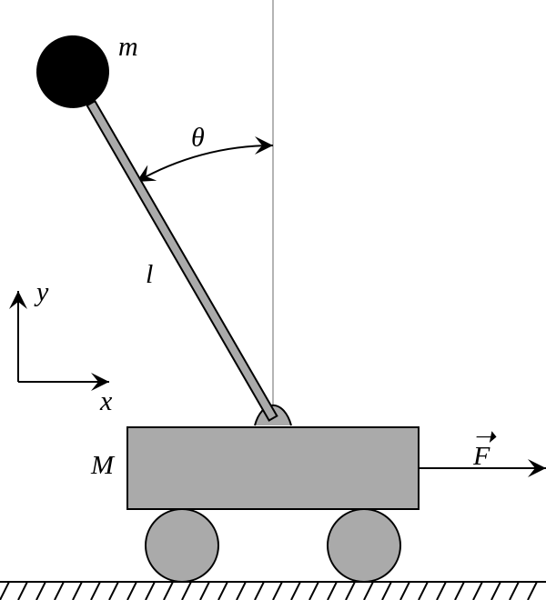
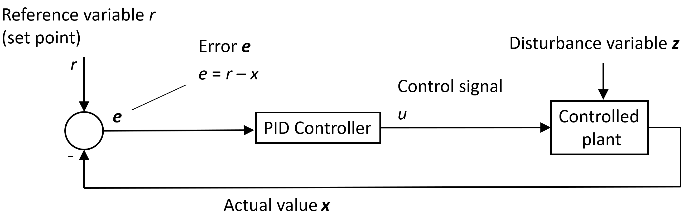
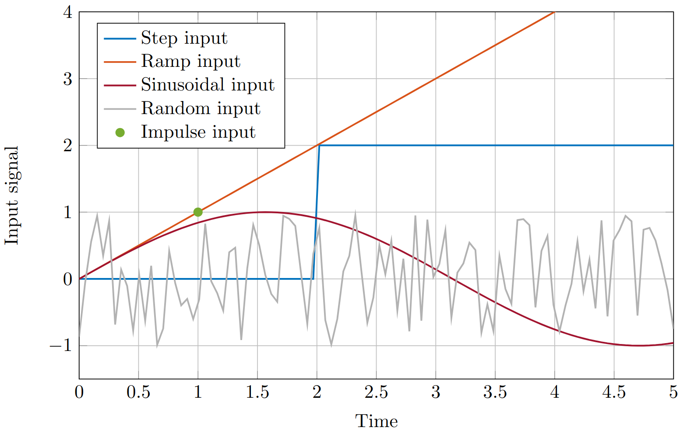
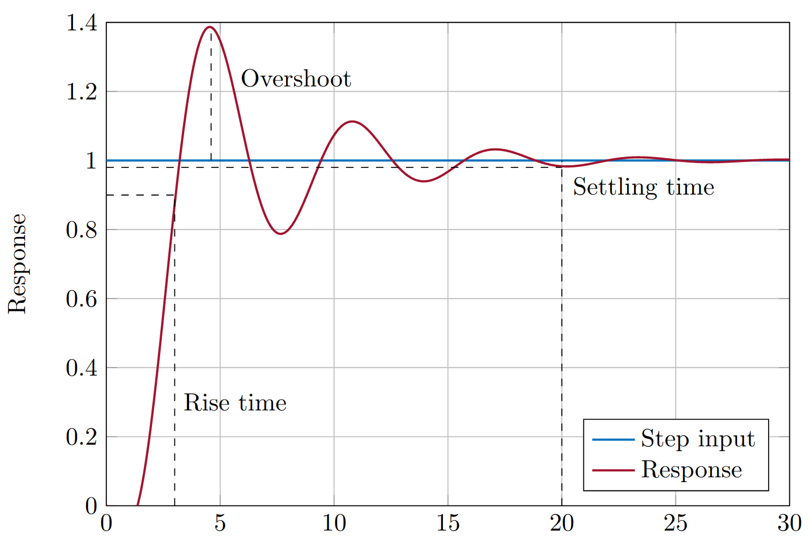

# Task Sheet: Inverted Pendulum

## Introduction

The inverted pendulum system is a classic example of a dynamic system that poses a real challenge in the field of control engineering due to its inherently unstable nature. This system consists of a pendulum that has its mass above its pivot point and is mounted on a moving cart. The primary goal in controlling an inverted pendulum is to apply forces to the cart in such a way that the pendulum remains upright and stable, despite disturbances or changes in motion. This system is inherently unstable. Small disturbances or deviations from the upright position will be amplified, causing the pendulum to fall quickly if uncorrected. Successful control of this system requires a feedback mechanism that reacts continuously to the pendulum’s state to maintain balance.

In this task, you will develop and implement control strategies to stabilize the inverted pendulum.

---

## Feedback Control and PID

Many software problems involve interaction with dynamic external processes. Feedback control is a powerful paradigm for managing those interactions. In feedback control, sensors measure the current state (e.g., position and angle of the pendulum), which is compared to the desired state. The difference (error) is fed into a controller, which calculates a corrective action to drive the system toward the desired state.

Many software problems involve interaction with dynamic external processes (e.g., network traffic). Feedback control is a powerful paradigm for managing those interactions. In feed- back control of dynamical systems, we use sensors to measure the current state of the system (such as the position and angle of the pendulum). This measurement is compared to the desired state (e.g., the pendulum balanced upright). The difference, known as the error, is fed into a controller. The controller calculates a corrective action designed to drive the system towards the desired state. The figure below shows a controller in a feedback loop.

A **PID (Proportional-Integral-Derivative) controller** is a widely used feedback control mechanism. It has three components, each targeting different aspects of the error signal:

- **Proportional (P):** Provides a corrective action proportional to the size of the current error.
  $$
  u_P(t) = K_p \cdot e(t)
  $$
- **Integral (I):** Considers the accumulated error over time, helping to eliminate persistent offsets.
  $$
  u_I(t) = K_i \cdot \int e(t)
  $$
- **Derivative (D):** Anticipates the rate of change of the error, improving the system’s responsiveness and damping oscillations.
  $$
  u_D(t) = K_d \cdot \frac{de(t)}{dt}
  $$

The three components are combined to form the complete PID controller output:

$$
u(t) = K_p \cdot e(t) + K_i \cdot \int e(t) \, dt + K_d \cdot \frac{de(t)}{dt}
$$

where $u(t)$ is the PID controller output, $K_p$ is the Proportional gain, $K_i$ is the Integral gain, and $K_d$ is the Derivative gain. Think of the PID controller as an algorithm with the goal of minimizing error. Like many algorithms, its parameters ($K_p$, $K_i$, $K_d$) need careful tuning. The ideal controlled closed-loop response matches the reference input signal. Various common input signals are depicted in the figure below.

---

## Discrete-Time Implementation

Since computers handle signals in discrete time steps, we need a discrete-time version of the PID controller. The equasion below gives the controller output at time step k, that depends on controller output at previous time steps, as well as error on current time step and previous time steps.

$$
u(k) = \frac{b_0}{a_0} e(k) + \frac{b_1}{a_0} e(k-1) + \frac{b_2}{a_0} e(k-2) - \frac{a_1}{a_0} u(k-1) - \frac{a_2}{a_0} u(k-2)
$$

where,

- **a₀** = 1 + N × Tₛ
- **a₁** = –(2 + N × Tₛ)
- **a₂** = 1
- **b₀** = Kₚ × (1 + N × Tₛ) + Kᵢ × Tₛ × (1 + N × Tₛ) + K_d × N
- **b₁** = –[Kₚ × (2 + N × Tₛ) + Kᵢ × Tₛ + 2 × K_d × N]
- **b₂** = Kₚ + K_d × N

$N$ represents the derivative filter coefficient. The derivative term in a PID controller is designed to anticipate future error based on how quickly the error is changing. However, in real-world systems, sensor measurements are often noisy. This noise can get amplified by the derivative term, leading to large, erratic control signals. A derivative filter is a way to mitigate this problem. It essentially smooths out the derivative calculation, reducing its sensitivity to high-frequency noise. A larger $N$ means more smoothing and less sensitivity to noise, but also slower response to real changes. A smaller $N$ means less smoothing and more response to potentially more noise.

$T_s$ represents the sampling time. This is the time interval between when a controller takes a measurement (reads the sensor values) and then calculates and applies a new control input. A shorter sampling time means your controller reacts more frequently to changes in the system. Computer implementations always approximate continuous-world ideas. Consider how the choice of sampling time $T$ might impact the controller’s performance. In an ideal situation, this delay would be equal to the sampling time. The controller calculates the new output immediately after taking a measurement.

In real systems, there’s often some computational delay – the time it takes your program to do the control calculations. This introduces an extra delay on top of the sampling time.

---

## Control Response

Control response refers to the behavior of a system in reaction to changes in its input signals. Understanding control response is crucial for designing and analyzing control systems. By studying how systems react to input signals, you can optimize system performance, ensure **stability**, and achieve desired objectives. The control response can be subdivided into transient response and steady-state response.

**Transient response** characterizes how a system behaves during the initial phase following a change in input signal. The figure below shows the transient control response to step input. It provides insights into how quickly a system reaches its new steady-state condition and how smoothly it does so. Key metrics used to evaluate transient response include:

Control response refers to how a system reacts to input changes. It is crucial for designing and analyzing control systems. The response can be subdivided into:

- Rise time – measures how quickly the system responds to a step input
- Settling time – indicates how long it takes for the system to stabilize within a certain tolerance band (e.g., 1 %) around the final value
- Overshoot – quantifies the extent to which the system exceeds its final value before settling

**Steady-state** response refers to the behavior of a system once it has settled into a stable condition following a change in input signal. It is characterized by the system’s long-term behavior. Steady-state error, the difference between the desired and actual output values in the long run, is a key metric used to evaluate system performance. Minimizing steady-state error is essential for achieving accurate control.

The response of a control system is heavily influenced by the parameters of its controller, par- ticularly in the case of **PID** (Proportional-Integral-Derivative) controllers. The proportional gain affects the system’s response speed and steady-state error, the integral time influences the system’s ability to eliminate steady-state error, and the derivative time impacts the sys- tem’s response to changes in input signal. Tuning these parameters appropriately is essential for optimizing system performance and achieving desired control objectives

---

## PID Controller Tuning Methods

Tuning PID controllers to achieve desired performance can be challenging. Several methods have been developed to tune PID controllers, each with its own advantages and limitations. However, manual tuning of control parameters, allows you to appreciate the effect of P, I and D components. Here is some general guideline, you can follow:

Start with a low proportional gain ($K_p$) and gradually increase it until the system starts to respond. Observe the system’s response and adjust $K_p$ to achieve the desired response characteristics, such as fast response without significant overshoot. Once a satisfactory $K_p$ value is found, introduce the integral gain ($K_i$) to eliminate any steady-state error. Increase $K_i$ gradually until steady-state error is minimized without causing instability. Finally, add derivative gain ($K_d$) to improve the system’s stability and reduce overshoot. Adjust $K_d$ to dampen oscillations without introducing excessive noise or instability.

---

## Inverted Pendulum Dynamics

### Simplifications and Assumptions

To make the analysis of the inverted pendulum more tractable, we start with simplifying assumptions:

1. rictionless Motion: The cart moves without frictional resistance.
2. Rigid Pendulum: The pendulum rod does not bend or flex.
3. Point Masses: The cart and pendulum mass can be concentrated at specific points.
4. 2D Motion: The system moves only in a single vertical plane.

### Equations of Motion

The following two equations represent the dynamics of inverted pendulum system:

#### Linear acceleration:

$$
\ddot{x} = -\frac{m_p l}{m_c + m_p} \ddot{\theta} \cos(\theta) - \frac{m_p l}{m_c + m_p} \dot{\theta}^2 \sin(\theta) + \frac{F}{m_c + m_p}
$$

#### Angular acceleration:

$$
\ddot{\theta} = \frac{m_p g l}{I_p + m_p l^2} \sin(\theta) - \frac{m_p l}{I_p + m_p l^2} \ddot{x} \cos(\theta)
$$

**Symbols:**

| Symbol          | Meaning                                                     |
| --------------- | ----------------------------------------------------------- |
| $m_p$           | Mass of the pendulum (kg)                                   |
| $l$             | Length of the pendulum (m)                                  |
| $m_c$           | Mass of the cart (kg)                                       |
| $g$             | Gravitational acceleration                                  |
| $I_p$           | Moment of inertia of the pendulum around its center of mass |
| $\ddot{x}$      | Acceleration of the cart (horizontal)                       |
| $\theta$        | Angle of the pendulum relative to vertical (rad)            |
| $\dot{\theta}$  | Angular velocity of the pendulum (rad/s)                    |
| $\ddot{\theta}$ | Angular acceleration of the pendulum                        |
| $F$             | External force applied to the cart (control input) (N)      |

Consider the list of symbols in the table above. The equasion for linear acceleration considers several factors. The first term represents the effect of the pendulum’s inertia. A larger pendulum mass ($m_p$) or a larger pendulum length ($l$) will cause a greater opposing force on the cart as it accelerates. The second term captures the effect of the pendulum’s angular velocity ($\dot{\theta}$). A faster-moving pendulum introduces a Coriolis force that influences the cart’s motion. The third term, $F/(mc + mp)$, represents the direct effect of the external force ($F$) applied to the cart, normalized by the total system mass.

The second equasion describes the angular acceleration ($\ddot{\theta}$) of the pendulum. The first term represents the torque caused by gravity acting on the pendulum. A larger pendulum mass ($m_p$), a longer pendulum ($l$), or a larger gravitational acceleration ($g$) will all amplify this torque, causing the pendulum to want to fall further away from the vertical position. The second term captures the effect of the cart’s horizontal acceleration ($\ddot{x}$). When the cart accelerates, it can pull the pendulum back slightly due to the connection between them. Understanding these equations is crucial for designing a controller that can manipulate the external force ($F$) to keep the pendulum balanced.

These equations are implemented in C++ simulator to calculate the system’s behavior for given initial conditions and control inputs. While you do not need to derive them from scratch, good understanding of the terms and their relationships is essential for designing an effective PID controller.

## Tasks

1. Study the provided C++ simulator code. You can download the zip file via moodle or via github link in moodle.
2. Implement PID controller.
   - Intialize paramaters for discrete PID controller PIDController::PIDController() in `controller.h` file.
   - Implement the PID controller output calculation in PIDController::output() in `controller.cpp` file.
   - Implement setClamp for setting the output limits in PIDController::setClamp() in `controller.cpp` file.
   - Implement the parameters update function for PID controller in PIDController::update params() in `controller.cpp` file.
   - Implement the reset function for PID controller in PIDController::reset() in `controller.cpp` file.
3. Tune the PID gains ($K_p$, $K_i$, $K_d$) to stabilize the inverted pendulum.
4. Simulate for reference angle 0, +0.1, −0.1 rad.
5. Implement delay and jitter in communication between sensor and controller
   - Implement simulator function to update parameters for delay and jitter in Simulator::update params in`simulator.cpp` file
   - Implement delay and jitter by changing delay index based on SimParams.delay and SimParams.jitter in Simulator::run simulator() in `simulator.cpp` file
